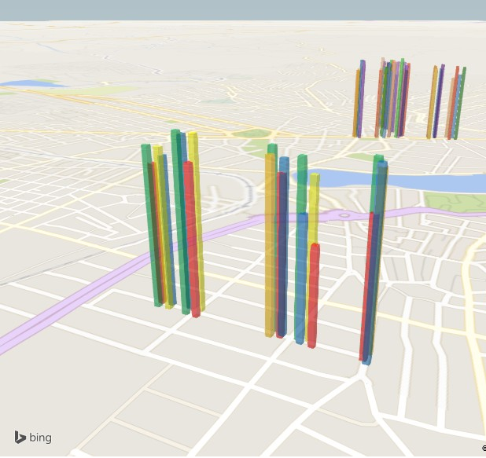

```{r setup, include=FALSE}
library("vioplot")
library("ggplot2")
library("dplyr")
library("knitr")
library("texreg")
library("ineq")
library(R.utils)
library("reshape")
#library("spatcounts")
#library("nonnest2")#https://cran.r-project.org/web/packages/nonnest2/nonnest2.pdf

multiplot <- function(..., plotlist=NULL, file, cols=1, layout=NULL) {
  library(grid)

  # Make a list from the ... arguments and plotlist
  plots <- c(list(...), plotlist)

  numPlots = length(plots)

  # If layout is NULL, then use 'cols' to determine layout
  if (is.null(layout)) {
    # Make the panel
    # ncol: Number of columns of plots
    # nrow: Number of rows needed, calculated from # of cols
    layout <- matrix(seq(1, cols * ceiling(numPlots/cols)),
                    ncol = cols, nrow = ceiling(numPlots/cols))
  }

 if (numPlots==1) {
    print(plots[[1]])

  } else {
    # Set up the page
    grid.newpage()
    pushViewport(viewport(layout = grid.layout(nrow(layout), ncol(layout))))

    # Make each plot, in the correct location
    for (i in 1:numPlots) {
      # Get the i,j matrix positions of the regions that contain this subplot
      matchidx <- as.data.frame(which(layout == i, arr.ind = TRUE))

      print(plots[[i]], vp = viewport(layout.pos.row = matchidx$row,
                                      layout.pos.col = matchidx$col))
    }
  }
}

#Merge users not from campina with places and info
users_not_campina <- read.table("../backupBanco/idsGerais/notcampina.dat", skip=1)
users_info <- read.table("../backupBanco/idsGerais/usersInfo.dat", sep="|")
users_profile <- read.csv("../backupBanco/users.csv", header=FALSE)
users_n_answered <- read.table("../backupBanco/idsGerais/usersNAnswered.dat")

not_camp_info <- merge(merge(users_not_campina, dplyr::select(users_info, V1, V2), by.x = "V1", by.y = "V1"), users_profile, by.x = "V1", by.y = "V1")
#View(dplyr::select(not_camp_info, V1, V2.x, V4, V5))
not_answered <- merge(select(users_n_answered, V1), dplyr::select(users_profile, V1, V3, V5), by.x = "V1", by.y = "V1")
#View(not_answered)
```

Os estudos de percepção realizados até o momento têm focado em capturar diversas imagens espalhadas pela cidade, obter os QScores/preferências das pessoas e treinar modelos de mais baixo nível ou alto nível (vide nosso artigo do HT ou o artigo com índice de ceu, verde, etc.) para predizer preferências para novas fotos que ainda não foram avaliadas por pessoas (**visão macro**). Com isso surgem alguns pontos a serem considerados:

1. A coleta nos artigos gera uma pergunta: Ao escolhermos pontos tão esparsos estamos considerando a média dos ambientes, isso é representativo?
* No Place Pulse são coletadas mais de uma imagem por local (2 ou mais direções) para lidar com variação e foram 1.706 imagens para NY, 1.236 para Boston, 544 para Salzburg e 650 para Linz
+ Na análise dos Q-Scores por dados de homícidio usa-se a média no zip-code;
* Na segunda versão do Place Pulse tem-se 2984 pontos coletados em São Paulo e se considerarmos o total de 48.623 ruas da cidade, mesmo se fosse um ponto por rua **foram cobertos 6,1% das ruas (pouca cobertura!)**.

```{r}
  teste <- read.csv("~/workspace_doutorado/Place Pulse/pp2_20161010/votes.csv", header=TRUE)#/local/david/workspace_doutorado/Place Pulse/pp2_20161010/votes.csv
  lat_min <- -23.401371#Sao Paulo
  lat_max <- -24.006227
  lon_min <- -46.334217
  lon_max <- -46.821569
  left_ids <- filter(teste, (teste$left_lat >= lat_max & teste$left_lat <= lat_min)  &  (teste$left_long >= lon_max & teste$left_long <= lon_min))$left_id
  right_ids <- filter(teste, (teste$right_lat >= lat_max & teste$right_lat <= lat_min)  &  (teste$right_long >= lon_max & teste$right_long <= lon_min))$right_id
  length(unique(append(left_ids, right_ids)))
  #https://super.abril.com.br/cultura/quantas-ruas-existem-em-sao-paulo/
```


* No Urban Gems, cena aleatória dentro de 300m do metrô e dentro dos bounding-box de áreas de censo. 258 Street View e 310 do Geograph, múltiplas visões do local
* No Como é Campina? escolhemos pontos distantes 50m, dentro dos setores censitários.
  + Pela análise do Como é Campina?, focando em divergências, nós encontramos **11 pontos (22 imagens), para o agradável, com diferenças no Q-Score maiores que 1 ponto. Diferenças maiores que 1 ponto, para o agradável, conduziram a diferenças de 25 a 107 posições no ranking e de 26 a 107 posições, para segurança**.
+ Podemos considerar a variação nas médias e ICs quando temos mais imagens e quando só temos 2 ou 3 imagens por rua

2. Os **modelos treinados com estes conjuntos de dados tendem a capturar as tendências médias**, o típico presente nos dados. E se pensarmos em analisar outro contexto social, ruas de outros locais ou, ainda, traçar um panorama detalhado de alguma rua?
* Em relação ao contexto social podemos pensar em lidar capturando preferências dos diferentes segmentos sociais, diferentes culturas
* Em relação às ruas de outras cidades podemos pensar em capturar imagens de outras cidades, cujo contexto seja mais parecido com o contexto da cidade que queremos avaliar

* **Exemplos**: 
+ Alguns casos interessantes. 
+ Amostra anterior: A imagem abaixo teve nota 4.30 (posição 28) mesmo contendo casas bem mantidas e árvores, por conta do terreno!

<div class='row'>
<div class='col-xs-4'>

<div class='caption'>Q-Score = 4.30 (posicao 28)</div>
</div>
</div>

+ Amostra Atual: A imagem primeira imagem tem um bom nível de manutenção, árvores e calçadas razoáveis, todavia pelos restos de construção teve uma nota menor e comparável a um terreno baldio da segunda imagem. As imagens 1, 2, 4 e 5, apesar de bem distintos quanto a árvores, manutenção tiveram notas parecidas! 

<div class='row'>
<div class='col-xs-4'>

<div class='caption'>Q-Score = 4.74 (posicao ??)</div>
</div>
<div class='col-xs-4'>

<div class='caption'>Q-Score = 4.68 (posicao ??)</div>
</div>
<div class='col-xs-4'>

<div class='caption'>Q-Score = 5.12 (posicao ??)</div>
</div>
</div>
<div class='row'>
<div class='col-xs-4'>

<div class='caption'>Q-Score = 4.75 (posicao ??)</div>
</div>
<div class='col-xs-4'>

<div class='caption'>Q-Score = 4.69 (posicao ??)</div>
</div>
<div class='col-xs-4'>

<div class='caption'>Q-Score = 4.24 (posicao ??)</div>
</div>
<div class='col-xs-4'>

<div class='caption'>Q-Score = 5.49 (posicao ??)</div>
</div>
</div>

3. O grande ponto positivo destas análises é aprender melhor sobre características médias presentes nos locais que favorecem ou não as preferências e aprender um pouco sobre o as preferências típicas dos votantes em relação a essas características. **Por não termos visão completa, cheiro, etc. tipicamente justifica-se como limitação para gerar a percepção do local!**

4. Existe uma discussão no urbanismo sobre **top-down e bottom-up design** (https://books.google.com.br/books?id=M-H0AgAAQBAJ&pg=PA255&lpg=PA255&dq=what+is+opposed+to+bird%27s+eye+view+urbanism&source=bl&ots=8owGSyzJpv&sig=8bFt7WNHhCuNqKmvwMclv9XQlt8&hl=pt-BR&sa=X&ved=0ahUKEwjS8Ifqq7rZAhWCkZAKHU9QCyoQ6AEITDAJ#v=onepage&q=what%20is%20opposed%20to%20bird's%20eye%20view%20urbanism&f=false):
* top-down, bird’s eye view, plan mostra a organização, não a experiência, a qualidade, o charme, nossa ligação emocional com a cidade do dia a dia
* Incorporar os locais e seu conhecimento no planejamento precisa de uma abordagem bottom-up
* Uma cidade projetada com foco no landscape não pode ser apreciada por uma visão bird’s eye. Estilos de arquitetura, escala humana não podem ser experimentados por esta visão. 


5. E o panorama detalhado da rua (**visão micro**)? Com essa ideia estamos buscando **descrever, encontrar problemas/virtudes, avaliar as particularidades**, ou o que podemos ganhar/perder, pensando em captura de percepções em um nível mais micro em relação à captura de percepção em um nível mais macro.
* Este estudo micro casa bem com o cenário no qual podemos pensar em um sistema de coleta da percepção dos moradores sobre sua rua e uso desta ferramenta para pressão e argumentação junto à autoridades
* Precisamos ter ideias mais precisas de como são as várias ruas daquela cidade, suas particularidades, para que os modelos treinados com esses dados possam reproduzir mais fielmente as preferências das pessoas sobre aqueles locais?
+ Se pensarmos em termos o melhor modelo possível, que reproduza fielmente a opinião das pessoas, o que **podemos descrever e apontar de virtudes/problemas**?
* Se para nos aproximarmos de modelos/descrições mais detalhadas de ruas precisamos de muitos dados/fotos da cidade, começamos a nos deparar com alguns problemas: 
+ As grandes bases que existem (PlacePulse, UrbanGems, StreetSeen?) pouco tem do contexto sub-desenvolvido, particularmente do contexto brasileiro;
+ Mesmo no contexto brasileiro, temos aspectos sociais, culturais e cidades bem distintas entre as várias partes do país

Estamos pensando em o que fazer com esses dados, como computar e apresentar pontos úteis no mundo micro! Para tentar avaliar melhor esses aspectos, foram escolhidas 6 ruas de Campina Grande, 20 fotos por rua (5 pontos da rua x 4 ângulos), para avaliação quanto à questão agradável. 3 dessas ruas apresentaram os pontos de maior divergência de percepção em nossa análise anterior (Edésio Silva, Inácio Marques e Cristina Procópio), uma rua apresentou o ponto de maior homogeneidade (Manoel Pereira), porém com notas baixas, e as outras ruas são pontos importantes do centro da cidade (Maciel Pinheiro e Floriano Peixoto), que tem uma tendência de homogeneidade, com notas boas.

As fotos de cada ruas foram comparadas com as de outras ruas, ao invés de apenas naquela rua, de modo que possamos comparar as ruas entre si e, também, tenhamos uma maior variação de tipos de locais comparados entre si.

Alguns questionamentos foram inicialmente levantados:

1. Na média as ruas são parecidas ou não? Tem alguma rua que parece muito boa ou muito ruim?
2. Será que ruas que são parecidas na média, são de fato similares?
3. Podemos descrever cada rua? Problemas/virtudes (pontos notáveis)?

# Caracterização Geral

## Tamanho das amostras 

Abaixo temos, primeiramente, uma análise, para determinar o tamanho da amostra para 95% de confiança. Em seguida, temos a comparação do ranking geral da amostra atual contendo 596 pessoas (283 pessoas que não são de Campina e 278 que são daqui), com a amostra de 29 usuários (primeira amostra analisada, só de moradores) e com a amostra de 69 pessoas (sendo também todos moradores de Campina).

```{r}
#Checking sample size
current_data <- read.table("all100/all_ordenado.dat")
current_data$sd <- apply(current_data[,4:ncol(current_data)], 1, sd)
current_data$n <- ( 1.96 * current_data$sd / 0.2) ** 2  #All QScores
print(">>>> Maior e menor amostra necessária ")
print(max(current_data$n))
print(min(current_data$n))

#Checking rankings similarity
mergeSort <- function(x){
  if(length(x) == 1){
    inv <- 0
  } else {
    n <- length(x)
    n1 <- ceiling(n/2)
    n2 <- n-n1
    y1 <- mergeSort(x[1:n1])
    y2 <- mergeSort(x[n1+1:n2])
    inv <- y1$inversions + y2$inversions
    x1 <- y1$sortedVector
    x2 <- y2$sortedVector
    i1 <- 1
    i2 <- 1
    while(i1+i2 <= n1+n2+1){
      if(i2 > n2 || (i1 <= n1 && x1[i1] <= x2[i2])){
        x[i1+i2-1] <- x1[i1]
        i1 <- i1 + 1
      } else {
        inv <- inv + n1 + 1 - i1
        x[i1+i2-1] <- x2[i2]
        i2 <- i2 + 1
      }
    }
  }
  return (list(inversions=inv,sortedVector=x))
}
numberOfInversions <- function(x){
  r <- mergeSort(x)
  return (r$inversions)
}
normalizedKendallTauDistance2 <- function(data1, data2){
  x <- data1
  y <- data2
  
  tau = numberOfInversions(order(x)[rank(y)])
  print(tau)
  nItens = length(x)
  maxNumberOfInverstions <- (nItens*(nItens-1))/2
  normalized = tau/maxNumberOfInverstions

  print (normalized)
}
data29 <- read.table("29users/all_ordenado.dat")

d29_cur <- merge(select(data29, V2, V3), select(current_data, V2, V3), by = "V2")
print(cor.test(d29_cur$V3.x, d29_cur$V3.y, method = "kendall"))
print(cor.test(d29_cur$V3.x, d29_cur$V3.y, method = "spearman"))

print(paste(">>>> Kendall Distance ", normalizedKendallTauDistance2(d29_cur$V3.x, d29_cur$V3.y)))

data69 <- read.table("69users/all_ordenado.dat")

d69_cur <- merge(select(data69, V2, V3), select(current_data, V2, V3), by = "V2")
print(cor.test(d69_cur$V3.x, d69_cur$V3.y, method = "kendall"))
print(cor.test(d69_cur$V3.x, d69_cur$V3.y, method = "spearman"))

print(paste(">>>> Kendall Distance ", normalizedKendallTauDistance2(d69_cur$V3.x, d69_cur$V3.y)))

men <- read.table("all100/all_masculino_ordenado.dat")
women <- read.table("all100/all_feminino_ordenado.dat")
men_wo <- merge(select(men, V2, V3), select(women, V2, V3), by = "V2")
print(cor.test(men_wo$V3.x, men_wo$V3.y, method = "kendall"))
print(cor.test(men_wo$V3.x, men_wo$V3.y, method = "spearman"))
```

## Comparação entre rankings de moradores e não moradores

O processo de separação de quem é ou não de Campina obedeceu as seguintes regras:

1. O usuário informando se é morador ou não ou através do IP;
2. Para os que não são moradores, foi verificado se ele informou se conhece a cidade e se estuda, mora ou trabalha aqui. Nestes casos, estes usuários foram adicionados ao conjunto de moradores (arquivo users_notcampina_campina.dat);
3. Por fim, alguns usuários que não responderam ao questionário mas foram identificados pelo pesquisador como ex-moradores da cidade, também foram adicionados ao conjunto de moradores.

Feita a seleção de quem é morador e não morador de Campina temos, atualmente, 278 moradores e 283 não moradores. **Quão parecido é o ranking geral de moradores e não moradores?**

```{r, echo=FALSE}
datacampina <- read.table("all100/all_campina_ordenado.dat")
datanotcampina <- read.table("all100/all_notcampina_ordenado.dat")

camp_notcampina <- merge(select(datacampina, V2, V3), select(datanotcampina, V2, V3), by = "V2")
print(cor.test(camp_notcampina$V3.x, camp_notcampina$V3.y, method = "kendall"))
print(cor.test(camp_notcampina$V3.x, camp_notcampina$V3.y, method = "spearman"))

print(paste(">>>> Kendall Distance ", normalizedKendallTauDistance2(camp_notcampina$V3.x, camp_notcampina$V3.y)))
```

Composição social de todos os usuários

```{r, echo=FALSE, out.extra='',fig.height=10, fig.width=12, warning=FALSE}
count_profile <- function(listOfFiles) {
  listOfValues <- c()
  keys <- c()
  for (file in listOfFiles){
     listOfValues <- append(listOfValues, nrow(read.table(file))-1)
     key_to_save <- ""
     if(grepl("media", file)){
       key_to_save <- "Média"
     }else if(grepl("baixa", file)){
       key_to_save <- "Baixa"
     }else if(grepl("masculino", file)){
       key_to_save <- "Masculino"
     }else if(grepl("feminino", file)){
       key_to_save <- "Feminino"
     }else if(grepl("jovem", file)){
       key_to_save <- "Jovem"
     }else if(grepl("adulto", file)){
       key_to_save <- "Adulto"
     }
     keys <- append(keys, key_to_save)
  }
  counters = data.frame(key=keys, value=listOfValues)
  
  gender_data <-filter(counters, grepl("Masculino", key) | grepl("Feminino", key)) %>% mutate(type="gender") %>% mutate(percent=value/sum(value))
  age_data <-filter(counters, grepl("Jovem", key) | grepl("Adulto", key)) %>% mutate(type="age") %>% mutate(percent=value/sum(value))
  income_data <-filter(counters, grepl("Baixa", key) | grepl("Média", key)) %>% mutate(type="income") %>% mutate(percent=value/sum(value))
  counters <- rbind(gender_data, income_data, age_data)
  
  polar <- ggplot(data=counters, aes(x=factor(1), y=percent, fill = factor(key))) + geom_bar(width = 1, stat="identity") + facet_grid(facets=.~type) + coord_polar(theta="y")
  
  #Gráficos de barras para tese
  genero <- data.frame( classe=c("Masculino", "Feminino"), valor=c(filter(counters, grepl("masculino", key))$value, filter(counters, grepl("feminino", key))$value) ) %>% mutate(percent=valor/sum(valor))
  gen_plot <- ggplot(genero, aes(x=classe, y=percent, fill=classe)) + geom_bar(width=1, stat="identity") + xlab("Gênero") + ylab("Percentual")
  
  renda <- data.frame( classe=c("Baixa", "Média Baixa", "Média", "Média Alta", "Alta"), valor=c(72, 47,  83, 51, 50) ) %>% mutate(percent=valor/sum(valor))
  renda$classe <- factor(renda$classe, levels = c("Baixa", "Média Baixa", "Média", "Média Alta", "Alta"))
  ren_plot <- ggplot(renda, aes(x=classe, y=percent, fill=classe)) + geom_bar(width=1, stat="identity") + xlab("Renda") + ylab("Percentual")
  
  idade <- data.frame( classe=c("18-", "18 a 24", "25 a 34", "35 a 44", "45 a 54", "55+"), valor=c(72, 77, 89, 27, 22, 17) ) %>% mutate(percent=valor/sum(valor))
  idade$classe <- factor(idade$classe, levels = c("18-", "18 a 24", "25 a 34", "35 a 44", "45 a 54", "55+"))
  ida_plot <- ggplot(idade, aes(x=classe, y=percent, fill=classe)) + geom_bar(width=1, stat="identity") + xlab("Idade") + ylab("Percentual")
  
  multiplot(polar, gen_plot, ren_plot, ida_plot, cols=1)
  ggsave("polar.pdf", plot=polar, width=10, height=5)
}

folder <- "../backupBanco/idsGerais/"
files <- c("adulto.dat", "baixa.dat", "feminino.dat", "jovem.dat", "masculino.dat", "media.dat")
listOfFiles <- paste(folder, files, sep="")
count_profile(listOfFiles)
```


Composição social de moradores de Campina

```{r,  echo=FALSE, out.extra='',fig.height=10, fig.width=12, warning=FALSE}
folder <- "../backupBanco/idsCampina//"
files <- c("adulto.dat", "baixa.dat", "feminino.dat", "jovem.dat", "masculino.dat", "media.dat")
listOfFiles <- paste(folder, files, sep="")
count_profile(listOfFiles)
```

Composição social de não moradores de Campina

```{r,  echo=FALSE, out.extra='',fig.height=10, fig.width=12, warning=FALSE}
folder <- "../backupBanco/idsNotCampina//"
files <- c("adulto.dat", "baixa.dat", "feminino.dat", "jovem.dat", "masculino.dat", "media.dat")
listOfFiles <- paste(folder, files, sep="")
count_profile(listOfFiles)
```

## Ranking Geral

Computados os QScores as 10 melhores e 10 piores imagens avaliadas estão apresentadas abaixo juntamente com as interseções das marcações dos usuários do porquê as escolheram como melhor ou pior imagem dentre as 4 apresentadas nas tarefas.

```{r results='asis', echo=FALSE, out.extra='', fig.height=10, fig.width=12}
show_general_ranking <- function (data, best_folder, worst_folder){
    top <- head(data, n=10)
    bottom <- tail(data, n=10)
    
    cat("<h3>Top", best_folder, "</h3>")
    cat("<div class='row'>")
    for(i in 1:nrow(top)) {
      row <- top[i,]
      photo_name <- as.character(row$photo_name)
      score <- row$V3
      
      cat("<div class='col-xs-4'>")
      cat("", sep = "")
      cat("<div class='caption'>", photo_name, " " , score,  "</div>", sep="")
      cat("</div>")
      if (i > 1 && i %% 3 == 0){
        cat("</div>")
        cat("<div class='row'>")
      }
    }
    cat("</div>")
    
    cat("<h3>Bottom", worst_folder, "</h3>")
    cat("<div class='row'>")
    for(i in 1:nrow(bottom)) {
      row <- bottom[i,]
      photo_name <- as.character(row$photo_name)
      score <- row$V3
      
      cat("<div class='col-xs-4'>")
      cat("", sep = "")
      cat("<div class='caption'>", photo_name, " " , score,  "</div>", sep="")
      cat("</div>")
      if (i > 1 && i %% 3 == 0){
        cat("</div>")
        cat("<div class='row'>")
      }
    }
    cat("</div>")
}

#All users top and bottom 10
novoV2 <- lapply(as.character(current_data$V2), function (x) strsplit(x, split="/", fixed=TRUE)[[1]][7])
novoV2 <- unlist(lapply(novoV2, '[[', 1))
novoV2 <- strsplit(novoV2, split="\\.jpg")
photo <- unlist(lapply(novoV2, '[[', 1))
current_data$photo_name <- photo
show_general_ranking(current_data, "../percepcaoLocal/agradavel/melhores/intersects/", "../percepcaoLocal/agradavel/piores/intersects/")

#Campina and not Campina top and bottom 10
novoV2 <- lapply(as.character(datacampina$V2), function (x) strsplit(x, split="/", fixed=TRUE)[[1]][7])
novoV2 <- unlist(lapply(novoV2, '[[', 1))
novoV2 <- strsplit(novoV2, split="\\.jpg")
photo <- unlist(lapply(novoV2, '[[', 1))
datacampina$photo_name <- photo
show_general_ranking(datacampina, "../percepcaoLocal/agradavel/melhorescampina/intersects/", "../percepcaoLocal/agradavel/piorescampina/intersects/")

novoV2 <- lapply(as.character(datanotcampina$V2), function (x) strsplit(x, split="/", fixed=TRUE)[[1]][7])
novoV2 <- unlist(lapply(novoV2, '[[', 1))
novoV2 <- strsplit(novoV2, split="\\.jpg")
photo <- unlist(lapply(novoV2, '[[', 1))
datanotcampina$photo_name <- photo
show_general_ranking(datanotcampina, "../percepcaoLocal/agradavel/melhoresnotcampina/intersects/", "../percepcaoLocal/agradavel/pioresnotcampina/intersects/")

top_size <- 10
diff1 <- length(setdiff(head(datacampina, n=top_size)$V2, head(datanotcampina, n=top_size)$V2))
diff2 <- length(setdiff(tail(datacampina, n=top_size)$V2, tail(datanotcampina, n=top_size)$V2))

cat("Top diff", diff1, "\n")
cat("Tail diff", diff2, "\n")

```

Qualitativamente analisando estas imagens, conforme esperado, percebe-se que **vegetação, melhor estado de manutenção e a rua mais larga** conduziram a melhores avaliações das imagens. O **céu** também foi um fator apontado em 4 das 10 fotos e que não foi computado em nossas avaliações anteriores. É importante destacar que a Cristina Procópio (tipicamente residencial) teve 5 dos 10 melhores, a Floriano Peixoto (comercial) teve 4 locais e a Edésio Silva 1 local (tipicamente residencial).

Para as imagens com pior avaliação, **a presença de itens na rua (barracas mal cuidadas, itens velhos, itens de venda, lixo, etc.) juntamente com prédios mal cuidados geraram maior desconforto**. É importante destacar que os 9 dos 10 locais com pior avaliação se localizam na Manoel Araújo, uma rua de comércio antiga e pouco cuidada no centro da cidade.

Alguns pontos a se questionar olhando todas as marcações:

* Algumas imagens da Manoel Pereira de Araújo e outros locais degradados foram marcados como melhores, apresentando poucos votos 1, 2 a 5 pessoas -> confusão na questão, preferência mesmo (algumas marcações no céu azul, prédios conservados)?
* Algumas imagens da Floriano, Maciel e Museu marcadas como piores -> confusão, preferência (carros, estilos de lojas)?

Realizando a análise da regressão dos QScores frente: # de árvores, nota de landscape, largura de rua, largura de calçada e número de prédios com identificadores

```{r, echo=FALSE}
input_regressao <- read.csv("input_regressao/regressao-input.csv")
plotRegAndLinear <- function(reg, test){
  #http://blog.minitab.com/blog/adventures-in-statistics-2/why-you-need-to-check-your-residual-plots-for-regression-analysis
  plot(reg)
  
  plot(test$street_wid, reg$resid)
  plot(test$sidewalk_wid, reg$resid)
  plot(test$landscape, reg$resid)
  plot(test$trees, reg$resid)
  plot(test$build_ident, reg$resid)
}
getLatLong <- function(data, fileWithCoord) {
  coord <- arrange(read.table(fileWithCoord, sep="+", header=F), V2)#V4 and V5 -> lat and long; V2 street
  data$lat <- 0
  data$long <- 0
  
  for (i in 1:nrow(coord)){
    row <- coord[i,]
    for (j in 1:nrow(data)){
      if(length(grep(row$V2, data[j,]$V2)) > 0){
        data[j,]$lat <- row$V4
        data[j,]$long <- row$V5
      }  
    }
  }
  return (data)
}

reg_input <- merge(current_data, input_regressao, by.x="V2", by.y="image") %>% do(arrange(., V3)) %>% mutate(rank = 1:n())
#Getting latitude and longitude data
library(spdep)
library(texreg)
res <- getLatLong(reg_input, "streetsQScoresLatLong.dat")
crd <- cbind(res$long, res$lat)
k2 <- knn2nb(knearneigh(unique(crd)))
maxDist <- max(unlist(nbdists(k2, unique(crd))))
neigh <- dnearneigh(crd, 0, 1000*maxDist, longlat=TRUE)#Neighborhoods based on distance! Which values to use as limits? From example were 0, 100; 0, 1 * max or 1.5 * max
neigh2 <- nb2listw(neigh, style = "B")#Binary weights, control amount of neighbors giving more influence to the ones with more neighbors!


reg_geral <- lm(rank ~ street_wid + sidewalk_wid + landscape + trees + build_ident + cyclists + mov_cars + people + park_cars, na.action = na.exclude, data = res)#rank ~ .*.
residuals <- resid(reg_geral)
#texreg(list(reg_geral), stars = c(0.1, 0.05, 0.01, 0.001), digits=3)
#Analysing regression! http://data.library.virginia.edu/diagnostic-plots/
plotRegAndLinear(reg_geral, reg_input)

#test for spatial autocorrelation using residuals: http://desktop.arcgis.com/en/arcmap/10.3/tools/spatial-statistics-toolbox/h-how-spatial-autocorrelation-moran-s-i-spatial-st.htm
moran <- lm.morantest(reg_geral, neigh2, alternative="two.sided")
moran.test(residuals, neigh2, alternative="two.sided")
summary(moran)
moran

#Standardized regression
#reg <- lm(rank ~ scale(street_wid) + scale(sidewalk_wid) + scale(landscape) + scale(trees) + scale(build_ident), na.action = na.exclude, data = select(reg_input, rank, street_wid, sidewalk_wid, landscape, trees, build_ident))#rank ~ .*.

#texreg(list(reg), stars = c(0.1, 0.05, 0.01, 0.001), digits=3)
```

Realizando a mesma regressão acima para moradores e não moradores de forma separada, percebe-se: 

1. Sidewalk width mais significativo e influente para moradores (média);
2. Landscape igualmente significativo nos 3, mais influente para moradores (média);
3. Trees mais significativo no geral e não moradores e mais influente para eles (média);
4. Builds ids igualmente significativo nos 3, mais influente para não moradores (média);
5. Os ICs apontam similaridade entre todos os coeficientes dos 3 grupos; 
6. R2 parecidos  

```{r, echo=FALSE, warning=FALSE}
#Campina residents 
reg_input <- merge(datacampina, input_regressao, by.x="V2", by.y="image") %>% do(arrange(., V3)) %>% mutate(rank = 1:n())
reg_campina <- lm(rank ~ street_wid + sidewalk_wid + landscape + trees + build_ident + cyclists + mov_cars + people + park_cars, na.action = na.exclude, data = select(reg_input, rank, street_wid, sidewalk_wid, landscape, trees, build_ident, cyclists, mov_cars, people, park_cars))#rank ~ .*.

#texreg(list(reg), stars = c(0.1, 0.05, 0.01, 0.001), digits=3)

#Standardized regression
#reg <- lm(rank ~ scale(street_wid) + scale(sidewalk_wid) + scale(landscape) + scale(trees) + scale(build_ident), na.action = na.exclude, data = select(reg_input, rank, street_wid, sidewalk_wid, landscape, trees, build_ident))#rank ~ .*.

#texreg(list(reg), stars = c(0.1, 0.05, 0.01, 0.001), digits=3)

#Campina non-residents
reg_input <- merge(datanotcampina, input_regressao, by.x="V2", by.y="image") %>% do(arrange(., V3)) %>% mutate(rank = 1:n())
reg_not_campina <- lm(rank ~ street_wid + sidewalk_wid + landscape + trees + build_ident + cyclists + mov_cars + people + park_cars, na.action = na.exclude, data = select(reg_input, rank, street_wid, sidewalk_wid, landscape, trees, build_ident, cyclists, mov_cars, people, park_cars))#rank ~ .*.

texreg(list(reg_geral, reg_campina, reg_not_campina), stars = c(0.1, 0.05, 0.01, 0.001), digits=3)

print(">>>>>> IC Geral x Campina x Not Moradores")
print(cbind( confint(reg_geral, level=0.95), confint(reg_campina, level=0.95), confint(reg_not_campina, level=0.95) ))

#Standardized regression
#reg <- lm(rank ~ scale(street_wid) + scale(sidewalk_wid) + scale(landscape) + scale(trees) + scale(build_ident), na.action = na.exclude, data = select(reg_input, rank, street_wid, sidewalk_wid, landscape, trees, build_ident))#rank ~ .*.

#texreg(list(reg), stars = c(0.1, 0.05, 0.01, 0.001), digits=3)

#Logistic regression
knitr::opts_chunk$set(echo = TRUE, warning = FALSE)
require(gmodels)
require(vcd)
require(lme4)
library(nlme)
library(caret)
library(pscl)
library(DT)
library(ggplot2)
theme_set(theme_bw())
#library(GGally)
library(dplyr, warn.conflicts = F)
library(broom)

library(car)
library(readr)

compare_glms <- function(baseline, model){
  modelChi <- baseline$deviance - model$deviance
  chidf <- baseline$df.residual - model$df.residual
  chisq.prob <- 1 - pchisq(modelChi, chidf)
  print(paste(modelChi, chidf, chisq.prob))
}

compare_null <- function(baselineModel){
  modelChi <- baselineModel$null.deviance - baselineModel$deviance
  chidf <- baselineModel$df.null - baselineModel$df.residual
  chisq.prob <- 1 - pchisq(modelChi, chidf)
  print(paste(modelChi, chidf, chisq.prob))
}

raw_data = read_delim(
  "classifier/classifier_input_wodraw.dat",
  delim = "\t",
  col_types = cols(
    .default = col_double(),
    row = col_integer(),
    choice = col_character(),
    question = col_character(),
    photo1 = col_character(),
    photo2 = col_character(),
    choice = col_integer(),
    userID = col_integer(),
    gender = col_character(),
    age = col_character(),
    income = col_character(),
    education = col_character(),
    city = col_character(),
    marital = col_character()
    #graffiti1 = col_character(),
    #bairro1 = col_character(),
    #graffiti2 = col_character(),
    #bairro2 = col_character()
    )
  )
bairro1 <- lapply(as.character(raw_data$photo1), function (x) strsplit(x, split="/",  fixed=TRUE)[[1]][6])
local <- unlist(lapply(bairro1, '[[', 1))
raw_data$bairro1 <- local
bairro2 <- lapply(as.character(raw_data$photo2), function (x) strsplit(x, split="/",  fixed=TRUE)[[1]][6])
local <- unlist(lapply(bairro2, '[[', 1))
raw_data$bairro2 <- local
raw_data$bairro1 <- factor(raw_data$bairro1)
raw_data$bairro2 <- factor(raw_data$bairro2)
raw_data$city <- factor(raw_data$city)

data = raw_data %>% 
  mutate( # Recode
    income = if_else(is.na(income), "media", income),
    age_cat = if_else(as.integer(age) >= 25 | is.na(age), "adulto", "jovem"),
    inc_cat = if_else(income %in% c("baixa", "media baixa"),
                         "baixa", 
                         "media"), # substituirá os NA
    choice = if_else(choice == "1", "0", 
                       if_else(choice == "-1", "1", choice)), 
    bair_cat = if_else(bairro1 == bairro2, "mesmo", 
                       paste0(bairro1, "_", bairro2))    
    ) %>% 
  mutate_at( # to factor
    vars(income, age_cat, inc_cat, bair_cat, choice, gender),
    as.factor) %>% 
  mutate( # relevel
    bair_cat = relevel(bair_cat,  "mesmo"),
    #marital = relevel(marital,  "solteiro"),
    income = relevel(income,  "baixa"),
    age_cat = relevel(age_cat,  "jovem"),
    gender = relevel(gender,  "feminino"),
    inc_cat = relevel(inc_cat,  "baixa"),
    city = relevel(city, "campina")
  ) 

# Create diff features
data = data %>%
  mutate(
    d_swidth = street_wid1 - street_wid2,
    d_sidewalk = sidewalk_wid1 - sidewalk_wid2,
    d_mvcars = mov_cars1 - mov_cars2,
    d_pcars = park_cars1 - park_cars2,
    d_trees = trees1 - trees2,
    d_mvciclyst = cyclists1 - cyclists2,
    d_lands = landscape1 - landscape2,
    d_bid = build_ident1 - build_ident2,
    #d_bheig = log2(build_height1 + 1) - log2(build_height2 + 1),
    #d_dbuild = diff_build1 - diff_build2,
    d_people = people1 - people2
    #d_graff = (graffiti1 == "Yes") - (graffiti2 == "Yes")
  )

# SPLIT + SCALE
agrad_scaled <- filter(data, !is.na(data$city)) %>% 
  mutate_at(vars(35:43), scale)
agrad_nscaled <- filter(data, !is.na(data$city))

create_model_only_int = function(the_data){
  return(glm(
    choice ~ 1,
    data = the_data,
    family = binomial())) 
  #gls(choice ~ 1, data = agrad, method = "ML")
}

create_model_only_int_random = function(the_data){
  return( glmer(choice ~ 1 + (1|userID), data = the_data, family=binomial()) )
  #lme(as.integer(choice) ~ 1, data = agrad, random = ~1|userID, method="ML")
}

#Logistic regressions assumptions: http://www.statisticssolutions.com/assumptions-of-logistic-regression/
create_model_w_interact = function(the_data){
  return(glm(
    choice ~ d_swidth + d_sidewalk + d_trees + d_lands + d_bid + d_people + d_mvciclyst + d_mvcars + d_pcars + bair_cat + 
      city:(d_swidth + d_sidewalk + d_trees + d_lands + d_bid + d_people + d_mvciclyst + d_mvcars + d_pcars),
    data = the_data,
    family = binomial()))
}

create_model_wo_profile = function(the_data){
  return(glm(
    choice ~ d_swidth + d_sidewalk + d_trees + d_lands + d_bid + d_people + d_mvciclyst + d_mvcars + d_pcars + bair_cat,
    data = the_data,
    family = binomial()))
}

#Random effects links: https://onlinecourses.science.psu.edu/stat502/node/171 (concepts, use); http://ase.tufts.edu/gsc/gradresources/guidetomixedmodelsinr/mixed%20model%20guide.html (how to specify in r); http://web.pdx.edu/~newsomj/mlrclass/ho_randfixd.pdf (variables, effects); http://liberalarts.utexas.edu/prc/_files/cs/Spring2013_Sasson_Fixed%20and%20Random%20Effects.pdf (examples of models formulas)
#- Extrapolar conclusoes alem dos dados que se tem; Dados desbalanceados em categorias; Foco na variancia e nao nas medias!

create_random_model_w_interact = function(the_data, optimizer_to_use=""){
  if ( nchar(optimizer_to_use) == 0 ){
    return( glmer( choice ~ d_swidth + d_sidewalk + d_trees + d_lands + d_bid+ d_people + d_mvciclyst + d_mvcars + d_pcars + bair_cat + 
      city:(d_swidth + d_sidewalk + d_trees + d_lands + d_bid + d_people + d_mvciclyst + d_mvcars + d_pcars  + bair_cat) + (1|userID), data = the_data, family=binomial() ) )
    
  }else{
    return( glmer( choice ~ d_swidth + d_sidewalk + d_trees + d_lands + d_bid + d_people + d_mvciclyst + d_mvcars + d_pcars + bair_cat + 
      city:(d_swidth + d_sidewalk + d_trees + d_lands + d_bid + d_people + d_mvciclyst + d_mvcars + d_pcars) + (1|userID), data = the_data, family=binomial(), control = glmerControl(optimizer=c(optimizer_to_use) ) ) )#optimizers="bobyqa", "Nelder_Mead"
  }
}

create_random_model_wo_interact = function(the_data, optimizer_to_use=""){
  if ( nchar(optimizer_to_use) == 0 ){
    return( glmer( choice ~ d_swidth + d_sidewalk + d_trees + d_lands + d_bid + d_people + d_mvciclyst + d_mvcars + d_pcars + bair_cat + 
      + (1|userID), data = the_data, family=binomial() ) )
    
  }else{
    return( glmer( choice ~ d_swidth + d_sidewalk + d_trees + d_lands + d_bid + d_people + d_mvciclyst + d_mvcars + d_pcars + bair_cat + 
      + (1|userID), data = the_data, family=binomial(), control = glmerControl(optimizer=c(optimizer_to_use) ) ) )#optimizers="bobyqa", "Nelder_Mead"
  }
}

computePseudoR2 <- function(baselineModel, completeModel){
  print("Hosmer and Lemeshow")
  print(  completeModel@devcomp$cmp['dev'] /  baselineModel@devcomp$cmp['dev'] )
  print("Hosmer and Lemeshow")
  print(  (baselineModel@devcomp$cmp['dev'] - completeModel@devcomp$cmp['dev']) /  baselineModel@devcomp$cmp['dev'] )
  print("Cox and Snells")
  cs <- 1 - exp( (completeModel@devcomp$cmp['dev'] - baselineModel@devcomp$cmp['dev']) / nrow(completeModel@frame)  )
  print(  cs  )
  print("Nagelkerke")
  print(  cs / ( 1 - exp(- baselineModel@devcomp$cmp['dev'] / nrow(completeModel@frame) )  )  )

}

#Testing if multilevel makes sense: intercept and intercept with multilevel
agrad_intercept_ns <- create_model_only_int(agrad_nscaled)
agrad_intercept_user_ns <- create_model_only_int_random(agrad_nscaled)
print(summary(agrad_intercept_ns))
print(summary(agrad_intercept_user_ns))
print(logLik(agrad_intercept_ns)*-2 )
print(logLik(agrad_intercept_user_ns)*-2)
print(anova(agrad_intercept_ns, agrad_intercept_user_ns))

agrad_random_user_nscaled <- create_model_w_interact(agrad_nscaled)#create_random_model_w_interact(agrad_nscaled, "")
print("Logistic model not scaled - with user being or not from campina")
print(summary(agrad_random_user_nscaled))

agrad_random_wo_user_nscaled <- create_model_wo_profile(agrad_nscaled)#create_random_model_wo_interact(agrad_nscaled, "")
print("Logistic model not scaled - without user being or not from campina")
print(summary(agrad_random_wo_user_nscaled))

print(logLik(agrad_random_wo_user_nscaled)*-2)
print(logLik(agrad_random_user_nscaled)*-2 )

print("Comparing deviance of models and chi-square values from table")
dif <- logLik(agrad_random_user_nscaled)*2 - logLik(agrad_random_wo_user_nscaled)*2 
print(dif)
print(qchisq(0.95, df=9))
print(qchisq(0.99, df=9))

#vuongtest(agrad_random_user_nscaled, agrad_random_wo_user_nscaled)#https://cran.r-project.org/web/packages/nonnest2/vignettes/nonnest2.pdf
#icci(agrad_random_user_nscaled, agrad_random_wo_user_nscaled)

#computePseudoR2(baselineModel = agrad_intercept_user_ns, completeModel = agrad_random_user_nscaled)

#Scaled
agrad_intercept <- create_model_only_int(agrad_scaled)
agrad_intercept_user <- create_model_only_int_random(agrad_scaled)

print(summary(agrad_intercept))
print(summary(agrad_intercept_user))

print(logLik(agrad_intercept)*-2 )
print(logLik(agrad_intercept_user)*-2)

agrad_random_user <- create_random_model_w_interact(agrad_scaled, "")
print("Random Effects scaled")
print(summary(agrad_random_user))
computePseudoR2(baselineModel = agrad_intercept_user, completeModel = agrad_random_user)

agrad_random_wo_user_scaled <- create_random_model_wo_interact(agrad_scaled, "")
print("Random Effects without user moderation scaled")
print(summary(agrad_random_wo_user_scaled))
```

As regressões logísticas, por outro lado, apontam uma melhoria no AIC em torno de 80 pontos quando usamos a moderação em relação a não usá-la e aponta preferências em relação a trees e landscape. De forma similar ao modelo OLS, preferências por mais árvores, calçadas mais largas, mais manutenção e menos identificadores foram percebidas em geral.

# Análise Geral das Ruas - Média e Dispersão

1. Na média as ruas são parecidas ou não? Tem alguma rua que parece muito boa ou muito ruim?

```{r, echo=FALSE, warning=FALSE}
#Calculating CI for each photo
current_data$ci <- current_data$sd * 1.96 / sqrt(100)
current_data <- arrange(current_data, photo_name)

qscoresDFGeral <- read.csv("qscores-df-geral.csv", header = TRUE)
qscoresDFCampina<- read.csv("qscores-df-campina.csv", header = TRUE)
qscoresDFNotCampina <- read.csv("qscores-df-notcampina.csv", header = TRUE)

#Getting data for each street to plot means and ICs for each street
plot_street_means <- function(data){
  edesio_scores = filter(data, street == "R._Edésio_Silva")$qscore
  edesio_sd = sd(edesio_scores)
  inacio_scores = filter(data, street == "R._Inácio_Marquês_da_Silva")$qscore
  inacio_sd = sd(inacio_scores)
  manoel_scores = filter(data, street == "R._Manoel_Pereira_de_Araújo")$qscore
  manoel_sd = sd(manoel_scores)
  maciel_scores = filter(data, street == "R._Maciel_Pinheiro")$qscore
  maciel_sd = sd(maciel_scores)
  floriano_scores = filter(data, street == "Av._Mal._Floriano_Peixoto")$qscore
  floriano_sd = sd(maciel_scores)
  cristina_scores = filter(data, street == "R._Cristina_Procópio_Silva")$qscore
  cristina_sd = sd(maciel_scores)
  
  new_frame = data.frame(mean_scores = c(mean(maciel_scores), mean(manoel_scores), mean(edesio_scores), mean(inacio_scores), mean(floriano_scores), mean(cristina_scores)), medians = c(median(maciel_scores), median(manoel_scores), median(edesio_scores), median(inacio_scores), median(floriano_scores), mean(cristina_scores)), street = c("Maciel", "Manoel", "Edesio", "Inacio", "Floriano", "Cristina"), ci = c(maciel_sd * 1.96 / sqrt(length(maciel_scores)),  manoel_sd * 1.96 / sqrt(length(manoel_scores)), edesio_sd * 1.96 / sqrt(length(edesio_scores)), inacio_sd * 1.96 / sqrt(length(inacio_scores)), floriano_sd * 1.96 / sqrt(length(floriano_scores)), cristina_sd * 1.96 / sqrt(length(cristina_scores))))
  
  p <- ggplot(new_frame, aes(x=street, y=mean_scores, fill=street)) + 
      geom_bar(position=position_dodge(), stat="identity") +
      geom_errorbar(aes(ymin=mean_scores-ci, ymax=mean_scores+ci),
                    width=.2,                    # Width of the error bars
                    position=position_dodge(.9)) + ylim(c(0,6))
  p + geom_point(data=new_frame, aes(x=street, y=medians, colour=street), shape=8, size=3)
}

print(">>>>> Média Geral")
plot_street_means(qscoresDFGeral)

#Campina and not campina residents
print(">>>>> Média Moradores")
plot_street_means(qscoresDFCampina)
print(">>>>> Média Não Moradores")
plot_street_means(qscoresDFNotCampina)
```

- A Manoel P. de Araújo realmente está bem abaixo das demais ruas;
- As outras 5 ruas possuem intervalos próximos, que podem ser confundíveis, apesar da Cristina e a Floriano parecerem ter uma tendência de melhores scores;

Como essas médias se comparam com os dados que tínhamos antes (pontos aleatórios) da rua ou ainda com pontos aleatórios dos novos dados?

```{r, echo=FALSE, warning=FALSE}
#Comparing current mean with mean obtained in Como e Campina - V1
v1_data <- filter(read.table("../../dadosSet16/usuario/all100/allGeralNew.dat"), V1 != "seguro?")
novoV2 <- lapply(as.character(v1_data$V2), function (x) paste(strsplit(x, split="/", fixed=TRUE)[[1]][7], sep=""))
local <- unlist(lapply(novoV2, '[[', 1))
novoV2 <- lapply(local, function (x) paste(strsplit(x, split="__", fixed=TRUE)[[1]][1], sep=""))
local <- unlist(lapply(novoV2, '[[', 1))
v1_data$street <- local

compare_street_means <- function(old_data, new_data){
  manoel_old <- filter(old_data, grepl("Manoel", street))$V3
  manoel_new = filter(new_data, street == "R._Manoel_Pereira_de_Araújo")$qscore
  
  inacio_old <- filter(old_data, grepl("Inacio_Marques", street))$V3
  inacio_new = filter(new_data, street == "R._Inácio_Marquês_da_Silva")$qscore
  
  edesio_old <- filter(old_data, grepl("Edesio_Silva", street))$V3
  edesio_new = filter(new_data, street == "R._Edésio_Silva")$qscore
  
  cristina_old <- filter(old_data, grepl("Cristina", street))$V3
  cristina_new = filter(new_data, street == "R._Cristina_Procópio_Silva")$qscore
  
  print(">>> Summary Manoel (Old x New)")
  print(length(manoel_old))
  print(summary(manoel_old))
  print(summary(manoel_new))
  
  print(">>> Summary Inacio")
  print(length(inacio_old))
  print(summary(inacio_old))
  print(summary(inacio_new))
  
  print(">>> Summary Edesio")
  print(length(edesio_old))
  print(summary(edesio_old))
  print(summary(edesio_new))
  
  print(">>> Summary Cristina")
  print(length(cristina_old))
  print(summary(cristina_old))
  print(summary(cristina_new))
  
  new_frame = data.frame(mean_scores = c(mean(manoel_old), mean(inacio_old), mean(edesio_old), mean(cristina_old), mean(manoel_new), mean(inacio_new), mean(edesio_new), mean(cristina_new)), medians = c(median(manoel_old), median(inacio_old), median(edesio_old), median(cristina_old), median(manoel_new), median(inacio_new), median(edesio_new), median(cristina_new)), street = c("Manoel", "Inacio", "Edesio", "Cristina", "Manoel_New", "Inacio_new", "Edesio_new", "Cristina_new"), ci = c(sd(manoel_old) * 1.96 / sqrt(length(manoel_old)),  sd(inacio_old) * 1.96 / sqrt(length(inacio_old)), sd(edesio_old) * 1.96 / sqrt(length(edesio_old)), sd(cristina_old) * 1.96 / sqrt(length(cristina_old)), sd(manoel_new) * 1.96 / sqrt(length(manoel_new)),  sd(inacio_new) * 1.96 / sqrt(length(inacio_new)), sd(edesio_new) * 1.96 / sqrt(length(edesio_new)), sd(cristina_new) * 1.96 / sqrt(length(cristina_new))))
  
  p <- ggplot(new_frame, aes(x=street, y=mean_scores, fill=street)) + 
      geom_bar(position=position_dodge(), stat="identity") +
      geom_errorbar(aes(ymin=mean_scores-ci, ymax=mean_scores+ci),
                    width=.2,                    # Width of the error bars
                    position=position_dodge(.9))
  p + geom_point(data=new_frame, aes(x=street, y=medians, colour=street), shape=8, size=3)
}

print(">>>>> Médias V1 x Dados Atuais")
compare_street_means(v1_data, qscoresDFGeral)

simulate_street_means <- function(data){
  edesio_scores <- c()
  inacio_scores <- c()
  manoel_scores <- c()
  cristina_scores <- c()
  floriano_scores <- c()
  maciel_scores <- c()
  edesio_sd <- c()
  inacio_sd <- c()
  manoel_sd <- c()
  cristina_sd <- c()
  floriano_sd <- c()
  maciel_sd <- c()
  #for (index in 1:1000){
      current_scores = sample(filter(data, street == "R._Edésio_Silva")$qscore, 3)
      current_sd = sd(current_scores)
      edesio_scores = append(edesio_scores, current_scores)
      edesio_sd = append(current_sd, edesio_sd)
      
      current_scores = sample(filter(data, street == "R._Inácio_Marquês_da_Silva")$qscore, 3)
      current_sd = sd(current_scores)
      inacio_scores = append(inacio_scores, current_scores)
      inacio_sd = append(current_sd, inacio_sd)
      
      current_scores = sample(filter(data, street == "R._Manoel_Pereira_de_Araújo")$qscore, 3)
      current_sd = sd(current_scores)
      manoel_scores = append(manoel_scores, current_scores)
      manoel_sd = append(current_sd, manoel_sd)
      
      current_scores = sample(filter(data, street == "R._Maciel_Pinheiro")$qscore, 3)
      current_sd = sd(current_scores)
      maciel_scores = append(maciel_scores, current_scores)
      maciel_sd = append(current_sd, maciel_sd)
      
      current_scores = sample(filter(data, street == "Av._Mal._Floriano_Peixoto")$qscore, 3)
      current_sd = sd(current_scores)
      floriano_scores = append(floriano_scores, current_scores)
      floriano_sd = append(current_sd, floriano_sd)
      
      current_scores = sample(filter(data, street == "R._Cristina_Procópio_Silva")$qscore, 3)
      current_sd = sd(current_scores)
      cristina_scores = append(cristina_scores, current_scores)
      cristina_sd = append(current_sd, cristina_sd)
  #}
  
  new_frame = data.frame(mean_scores = c(mean(maciel_scores), mean(manoel_scores), mean(edesio_scores), mean(inacio_scores), mean(floriano_scores), mean(cristina_scores)), medians = c(median(maciel_scores), median(manoel_scores), median(edesio_scores), median(inacio_scores), median(floriano_scores), mean(cristina_scores)), street = c("Maciel", "Manoel", "Edesio", "Inacio", "Floriano", "Cristina"), ci = c(maciel_sd * 1.96 / sqrt(length(maciel_scores)),  manoel_sd * 1.96 / sqrt(length(manoel_scores)), edesio_sd * 1.96 / sqrt(length(edesio_scores)), inacio_sd * 1.96 / sqrt(length(inacio_scores)), floriano_sd * 1.96 / sqrt(length(floriano_scores)), cristina_sd * 1.96 / sqrt(length(cristina_scores))))
  
  p <- ggplot(new_frame, aes(x=street, y=mean_scores, fill=street)) + 
      geom_bar(position=position_dodge(), stat="identity") +
      geom_errorbar(aes(ymin=mean_scores-ci, ymax=mean_scores+ci),
                    width=.2,                    # Width of the error bars
                    position=position_dodge(.9)) + ylim(c(0,6))
  p + geom_point(data=new_frame, aes(x=street, y=medians, colour=street), shape=8, size=3)
}
print(">>>>> Médias Simulando 3 pontos por rua")
simulate_street_means(qscoresDFGeral)
```

2. Será que ruas que são parecidas na média, são de fato similares?

5 das ruas selecionadas parecem bem similares de acordo com a média, mas será que são similares assim? Para isso computamos os violin plots de cada rua.

```{r, echo=FALSE, warning=FALSE }
print(">>>>> Todos os usuários e todas as fotos juntas")
value <- qscoresDFGeral$qscore

with(qscoresDFGeral , vioplot( value, col=rgb(0.1,0.4,0.7,0.7), names=c("Todos"), ylim = c(2.5, 7) ))

print(">>>>> Votos aleatórios")
random_votes <- read.table("all100/all_random_ordenado.dat")
value <- random_votes$V3

with(random_votes , vioplot(value, col=rgb(0.1,0.4,0.7,0.7), names=c("Todos"), ylim = c(2.5, 7) ))

print(">>>>> Todos os usuários por rua")
value <- qscoresDFGeral$qscore

with(qscoresDFGeral , vioplot( value[street=="R._Inácio_Marquês_da_Silva"] , value[street=="R._Edésio_Silva"], value[street=="R._Manoel_Pereira_de_Araújo"], value[street=="R._Maciel_Pinheiro"], value[street=="Av._Mal._Floriano_Peixoto"], value[street=="R._Cristina_Procópio_Silva"], col=rgb(0.1,0.4,0.7,0.7), names=c("Inacio","Edesio","Manoel", "Maciel", "Floriano", "Cristina"), ylim = c(2.5, 7) ))
title("Moradores")

print(">>>>> Moradores")
value <- qscoresDFCampina$qscore

with(qscoresDFCampina , vioplot( value[street=="R._Inácio_Marquês_da_Silva"] , value[street=="R._Edésio_Silva"], value[street=="R._Manoel_Pereira_de_Araújo"], value[street=="R._Maciel_Pinheiro"], value[street=="Av._Mal._Floriano_Peixoto"], value[street=="R._Cristina_Procópio_Silva"], col=rgb(0.1,0.4,0.7,0.7) , names=c("Inacio","Edesio","Manoel", "Maciel", "Floriano", "Cristina"), ylim = c(2.5, 7) ))#,  value[street=="Av._Mal._Floriano_Peixoto"], value[street=="R._Cristina_Procópio_Silva"]

print(">>>>> Não moradores")
value <- qscoresDFNotCampina$qscore

with(qscoresDFNotCampina , vioplot( value[street=="R._Inácio_Marquês_da_Silva"] , value[street=="R._Edésio_Silva"], value[street=="R._Manoel_Pereira_de_Araújo"], value[street=="R._Maciel_Pinheiro"],  value[street=="Av._Mal._Floriano_Peixoto"], value[street=="R._Cristina_Procópio_Silva"], col=rgb(0.1,0.4,0.7,0.7) , names=c("Inacio","Edesio","Manoel", "Maciel", "Floriano", "Cristina"), ylim = c(2.5, 7) ))

```

A partir da análise dos violin plots, alguns pontos podem ser destacados:

- A Manoel P. de Araújo foi realmente a rua com as notas em gerais mais baixas o que pode ser um indicativo de problema na rua. Analisando com mais cuidado as imagens da rua na próxima Seção, pode-se perceber que esses valores baixos eram esperados, já que se trata de uma área antiga e pouco cuidada do centro da cidade (bem degradada!);
- A Inacio Marques, Edesio silva e Cristina tiveram valores mais espalhados com uma maior concentração em algumas regiões, o que era esperado dado variações nos tipos de locais nessas ruas (mais ou menos verde, mais ou menos conservados). Existem concentrações de medianos para bons, porém a Inácio tem uma concentração de scores ruins e a Cristina tem algunas notas muito baixas;
- A Maciel Pinheiro tem uma maior concentração de valores com notas parecidas, o que era esperado dado a maior semelhança de locais ao longo de toda a rua. Isso a torna mais homogênea que as outras 4, porém mais heterogênea que a Manoel P. de Araujo;
- A Floriano também tem uma maior concentração de valores com notas parecidas, porém um pouco mais heterogêneas que a Maciel Pinheiro;
- A Inacio, Edesio, Floriano e Cristina possuem QScores que variam em 1.5 ou mais pontos. Essa grande variação merece ser analisada com mais cuidado já que pode ser um indicativo de problemas em certos locais das ruas!

Para complemento numérico dos violin plots, temos os coeficientes de dispersão/heterogeneidade e o sumário de cada rua na seguinte ordem: Inacio, Edesio, Maciel e Manoel. Aqui é importante destacar que:

* Os três pontos mais heterogêneos considerados foram, respectivamente, das ruas Inácio Marques, Edésio Silva e Cristina Procópio. É interessante observar que, apesar da ordem de heterogeneidade das ruas ser diferente, essas 3 ruas são as mais heterogêneas do nosso conjunto de dados.

```{r , echo=FALSE, warning=FALSE}
#GINI COEFFICIENTS
all_data <- merge(qscoresDFGeral, current_data, by.x = "url", by.y="V2")#qscoresDFGeral
all_data$street <- as.character(all_data$street)
all_data$street <- factor(all_data$street, levels=unique(all_data$street))
inequalities <- data.frame( labels=c("Gini", "Entropy", "SD"), edesio=c(ineq(filter(all_data, street == "R._Edésio_Silva")$qscore, type="Gini"), ineq(filter(all_data, street == "R._Edésio_Silva")$qscore, type="entropy"), sd(filter(all_data, street == "R._Edésio_Silva")$qscore)), inacio=c(ineq(filter(all_data, street == "R._Inácio_Marquês_da_Silva")$qscore, type="Gini"), ineq(filter(all_data, street == "R._Inácio_Marquês_da_Silva")$qscore, type="entropy"), sd(filter(all_data, street == "R._Inácio_Marquês_da_Silva")$qscore)), maciel=c(ineq(filter(all_data, street == "R._Maciel_Pinheiro")$qscore, type="Gini"), ineq(filter(all_data, street == "R._Maciel_Pinheiro")$qscore, type="entropy"), sd(filter(all_data, street == "R._Maciel_Pinheiro")$qscore)), manoel=c(ineq(filter(all_data, street == "R._Manoel_Pereira_de_Araújo")$qscore, type="Gini"), ineq(filter(all_data, street == "R._Manoel_Pereira_de_Araújo")$qscore, type="entropy"), sd(filter(all_data, street == "R._Manoel_Pereira_de_Araújo")$qscore)), floriano=c(ineq(filter(all_data, street == "Av._Mal._Floriano_Peixoto")$qscore, type="Gini"), ineq(filter(all_data, street == "Av._Mal._Floriano_Peixoto")$qscore, type="entropy"), sd(filter(all_data, street == "Av._Mal._Floriano_Peixoto")$qscore)), cristina= c(ineq(filter(all_data, street == "R._Cristina_Procópio_Silva")$qscore, type="Gini"), ineq(filter(all_data, street == "R._Cristina_Procópio_Silva")$qscore, type="entropy"), sd(filter(all_data, street == "R._Cristina_Procópio_Silva")$qscore)) )

gini <- melt(filter(inequalities, labels=="Gini"), id=c("labels"))
entropy <- melt(filter(inequalities, labels=="Entropy"), id=c("labels"))
SD <- melt(filter(inequalities, labels=="SD"), id=c("labels"))

arrange(gini, desc(value))
arrange(entropy, desc(value))
arrange(SD, desc(value))

summary(filter(qscoresDFGeral, street == "R._Inácio_Marquês_da_Silva")$qscore)
summary(filter(qscoresDFGeral, street == "R._Edésio_Silva")$qscore)
summary(filter(qscoresDFGeral, street == "R._Maciel_Pinheiro")$qscore)
summary(filter(qscoresDFGeral, street == "R._Manoel_Pereira_de_Araújo")$qscore)
summary(filter(qscoresDFGeral, street == "Av._Mal._Floriano_Peixoto")$qscore)
summary(filter(qscoresDFGeral, street == "R._Cristina_Procópio_Silva")$qscore)
```


# Uma impressão geral ao longo da rua

Após a análise das médias por rua e de suas desigualdades, vamos dar uma olhada geral ao longo de todas as ruas sob a visão de todos os usuários, só dos moradores e só dos não moradores. Com isso podemos perceber diferenças e semelhanças entre as ruas, com a presença de locais melhor/pior avaliados ao longo das mesmas.

>>> Considerando todos os respondentes

```{r  fig.height=10, fig.width=12, echo=FALSE, warning=FALSE}
library(ggmap)#https://rpubs.com/nickbearman/r-google-map-making
library(sp)

#Plotting Q-Scores through the street
all_data <- merge(qscoresDFGeral, current_data, by.x = "url", by.y="V2")#qscoresDFGeral
all_data$street <- as.character(all_data$street)
all_data$street <- factor(all_data$street, levels=unique(all_data$street))

getLatLong_2 <- function(data, fileWithCoord) {
  coord <- arrange(read.table(fileWithCoord, sep="+", header=F), V2)#V4 and V5 -> lat and long; V2 street
  data$lat <- 0
  data$long <- 0
  
  for (i in 1:nrow(coord)){
    row <- coord[i,]
    for (j in 1:nrow(data)){
      if(length(grep(row$V2, data[j,]$url)) > 0){
        data[j,]$lat <- row$V4
        data[j,]$long <- row$V5
      }  
    }
  }
  return (data)
}
plot_ci_per_photo <- function(data, plotTitle, ids1, ids2){
  pd <- position_dodge(0.1)
  data$xlabel <- factor(data$xlabel, levels = data$xlabel)
  data$side <- ""
  data$side[data$angle %in% ids1] <- "Side 1"
  data$side[data$angle %in% ids2] <- "Side 2"
  if(plotTitle == "Cristina Procopio"){
    data$side[data$num == 436 & (data$angle == 22 | data$angle == 135)] <- "Side 1"
    data$side[data$num == 436 & (data$angle == 203 | data$angle == 315)] <- "Side 2"
  }
  
  if(plotTitle == "Edésio Silva" || plotTitle == "Manoel Pereira"){
    data1 <- arrange(filter(data, side == "Side 1"), num, -angle)
    data2 <- arrange(filter(data, side == "Side 2"), num, angle)
  }else if (plotTitle == "Inacio"  || plotTitle == "Maciel Pinheiro" || plotTitle == "Cristina Procopio" || plotTitle == "Floriano Peixoto"){
    data1 <- arrange(filter(data, side == "Side 1"), num, angle)
    data2 <- arrange(filter(data, side == "Side 2"), num, angle)
    
    if (plotTitle == "Cristina Procopio"){
        to_change <- data1[nrow(data1)-1,]
        data1[nrow(data1)-1,] <- data1[nrow(data1),]
        data1[nrow(data1),] <- to_change
    }
  }
  
  #Plotting in the map
  #data_lat_lon <- getLatLong_2(data, "streetsQScoresLatLong.dat")
  #coords <- cbind(Longitude = as.numeric(as.character(data_lat_lon$long)), Latitude = as.numeric(as.character(data_lat_lon$lat)))
  #scores.pts <- SpatialPointsDataFrame(coords, select(data_lat_lon, url, qscore, lat, long), proj4string = CRS("+init=epsg:4326"))
  #campina_map <- qmap(location = 'Cristina Procópio, Campina Grande, Brasil', color="bw", legend = "topleft", zoom = 14)
  #campina_map <- get_googlemap(center = paste("Rua", plotTitle, ", Campina Grande, Brasil", sep= " "), zoom = 16)
  #mapa <- ggmap(campina_map)# + geom_point(data = data_lat_lon, aes(x = long, y = lat), size=3, alpha=0.5)
  
  #imgage <- png::readPNG("images/cristina.png")
  data1 <- data1 %>% mutate(xlabel = factor(xlabel, levels = rev(xlabel)))
  g1 <- ggplot(data1, aes(x=reorder(xlabel, num), y=V3, group=side, shape = factor(num)))+ geom_bar(position=position_dodge(), stat="identity", fill="#D55E00", alpha=0.5) + geom_errorbar(aes(ymin=V3-ci, ymax=V3+ci), colour="black", width=.1, position=pd) + theme_bw() + theme(axis.text.x = element_text(angle = 90, hjust = 1), plot.title = element_text(vjust=10)) + labs(x = "Street points", title = plotTitle, y = "Q-Score") #+annotation_custom(rasterGrob(imgage, width = unit(1,"npc"), height = unit(1,"npc")), -Inf, Inf, -Inf, Inf) 
 #geom_line(position=pd, colour="#D55E00") + geom_point(position=pd, size=4, colour="#D55E00") + ylim(c(2, 7))   #+ facet_wrap(~side, ncol=1, nrow=2, scales='free') #scale_colour_gradientn(colours=rainbow(4)) + scale_colour_hue()

  data2 <- data2 %>% mutate(xlabel = factor(xlabel, levels = rev(xlabel)))
  g2 <- ggplot(data2, aes(x=reorder(xlabel, num), y=V3, group=side, shape = factor(num))) + geom_bar(position=position_dodge(), stat="identity", fill="#56B4E9") + geom_errorbar(aes(ymin=V3-ci, ymax=V3+ci), colour="black", width=.1, position=pd) + theme_bw() + theme(axis.text.x = element_text(angle = 90, hjust = 1), plot.title = element_text(vjust=10)) + labs(x = "Street points", title = plotTitle, y = "Q-Score") #+ geom_line(position=pd, colour="#56B4E9") + geom_point(position=pd, size=4, colour="#56B4E9") + ylim(c(2, 7)) + labs(x = "Street points", title = plotTitle, y = "Q-Score") + theme_bw() + theme(axis.text.x = element_text(angle = 90, hjust = 1), plot.title = element_text(vjust=10))#+ scale_colour_hue()
  
  multiplot(g1, g2, cols=1)
  
}

all_data$xlabel <- paste("Num.:", all_data$num, " Angle: ", all_data$angle) 

plot_ci_per_photo(filter(all_data, street == "R._Maciel_Pinheiro"), "Maciel Pinheiro", c(360, 90), c(270, 180))#Street 3
plot_ci_per_photo(filter(all_data, street == "R._Manoel_Pereira_de_Araújo"), "Manoel Pereira", c(22, 135, 293), c(315, 112, 203, 225))#Street 4
plot_ci_per_photo(filter(all_data, street == "Av._Mal._Floriano_Peixoto"), "Floriano Peixoto", c(22,293), c(112,203))#Street 5
plot_ci_per_photo(filter(all_data, street == "R._Edésio_Silva"), "Edésio Silva", c(22, 135), c(315, 203))#Street 1
plot_ci_per_photo(filter(all_data, street == "R._Inácio_Marquês_da_Silva"), "Inacio", c(203, 112, 90), c(293, 270, 22))#Street 2
plot_ci_per_photo(filter(all_data, street == "R._Cristina_Procópio_Silva"), "Cristina Procopio", c(22, 45, 293, 315), c(135, 225))#Street 6 -> At number 436, 22 x 315 and 135 x 203
#http://colorbrewer2.org/#type=sequential&scheme=BuGn&n=4
```
<div class='row'>
<div class='col-xs-12'>

<div class='caption'>Cristina Procópio</div>
</div>
</div>

<div class='row'>
<div class='col-xs-12'>

<div class='caption'>Inácio Marques</div>
</div>
</div>


>>> Considerando só os moradores de Campina

```{r  fig.height=10, fig.width=12, echo=FALSE, warning=FALSE}
#Calculating CI for each photo - CAmpina residents
datacampina <- read.table("all100/all_campina_ordenado.dat")
datanotcampina <- read.table("all100/all_notcampina_ordenado.dat")
novoV2 <- lapply(as.character(datacampina$V2), function (x) strsplit(x, split="/", fixed=TRUE)[[1]][7])
novoV2 <- unlist(lapply(novoV2, '[[', 1))
novoV2 <- strsplit(novoV2, split="\\.jpg")
photo <- unlist(lapply(novoV2, '[[', 1))
datacampina$photo_name <- photo
novoV2 <- lapply(as.character(datanotcampina$V2), function (x) strsplit(x, split="/", fixed=TRUE)[[1]][7])
novoV2 <- unlist(lapply(novoV2, '[[', 1))
novoV2 <- strsplit(novoV2, split="\\.jpg")
photo <- unlist(lapply(novoV2, '[[', 1))
datanotcampina$photo_name <- photo

datacampina$sd <- apply(datacampina[,4:103], 1, sd)
datacampina$n <- ( 1.96 * datacampina$sd / 0.2) ** 2  #All QScores
datacampina$ci <- datacampina$sd * 1.96 / sqrt(100)
datacampina <- arrange(datacampina, photo_name)

all_data_camp <- merge(qscoresDFCampina, datacampina, by.x = "url", by.y="V2")#qscoresDFGeral
all_data_camp$street <- as.character(all_data_camp$street)
all_data_camp$street <- factor(all_data_camp$street, levels=unique(all_data_camp$street))

all_data_camp$xlabel <- paste("Num.:", all_data_camp$num, " Angle: ", all_data_camp$angle) 

plot_ci_per_photo(filter(all_data_camp, street == "R._Edésio_Silva"), "Edésio Silva", c(22, 135), c(315, 203))#Street 1
plot_ci_per_photo(filter(all_data_camp, street == "R._Inácio_Marquês_da_Silva"), "Inacio", c(203, 112, 90), c(293, 270, 22))#Street 2
plot_ci_per_photo(filter(all_data_camp, street == "R._Maciel_Pinheiro"), "Maciel Pinheiro", c(360, 90), c(270, 180))#Street 3
plot_ci_per_photo(filter(all_data_camp, street == "R._Manoel_Pereira_de_Araújo"), "Manoel Pereira", c(22, 135, 293), c(315, 112, 203, 225))#Street 4
plot_ci_per_photo(filter(all_data_camp, street == "Av._Mal._Floriano_Peixoto"), "Floriano Peixoto", c(22,293), c(112,203))#Street 5
plot_ci_per_photo(filter(all_data_camp, street == "R._Cristina_Procópio_Silva"), "Cristina Procopio", c(22, 45, 293, 315), c(135, 225))#Street 6 -> At number 436, 22 x 315 and 135 x 203
```

>>> Considerando só os não moradores de Campina

```{r results='asis', echo=FALSE, out.extra='', fig.height=10, fig.width=12, warning=FALSE}
#Calculating CI for each photo - CAmpina residents
datanotcampina$sd <- apply(datanotcampina[,4:103], 1, sd)
datanotcampina$n <- ( 1.96 * datanotcampina$sd / 0.2) ** 2  #All QScores
datanotcampina$ci <- datanotcampina$sd * 1.96 / sqrt(100)
datanotcampina <- arrange(datanotcampina, photo_name)

all_data_ncamp <- merge(qscoresDFNotCampina, datanotcampina, by.x = "url", by.y="V2")#qscoresDFGeral
all_data_ncamp$street <- as.character(all_data_ncamp$street)
all_data_ncamp$street <- factor(all_data_ncamp$street, levels=unique(all_data_ncamp$street))

all_data_ncamp$xlabel <- paste("Num.:", all_data_ncamp$num, " Angle: ", all_data_ncamp$angle) 

plot_ci_per_photo(filter(all_data_ncamp, street == "R._Edésio_Silva"), "Edésio Silva", c(22, 135), c(315, 203))#Street 1
plot_ci_per_photo(filter(all_data_ncamp, street == "R._Inácio_Marquês_da_Silva"), "Inacio", c(203, 112, 90), c(293, 270, 22))#Street 2
plot_ci_per_photo(filter(all_data_ncamp, street == "R._Maciel_Pinheiro"), "Maciel Pinheiro", c(360, 90), c(270, 180))#Street 3
plot_ci_per_photo(filter(all_data_ncamp, street == "R._Manoel_Pereira_de_Araújo"), "Manoel Pereira", c(22, 135, 293), c(315, 112, 203, 225))#Street 4
plot_ci_per_photo(filter(all_data_ncamp, street == "Av._Mal._Floriano_Peixoto"), "Floriano Peixoto", c(22,293), c(112,203))#Street 5
plot_ci_per_photo(filter(all_data_ncamp, street == "R._Cristina_Procópio_Silva"), "Cristina Procopio", c(22, 45, 293, 315), c(135, 225))#Street 6 -> At number 436, 22 x 315 and 135 x 203
```

# Analisando em detalhe cada rua

Para entender um pouco melhor cada rua, tentamos analisar os QScores obtidos ao longo da rua e confrontá-los com as imagens para tentar responder a questão abaixo:

3. Podemos descrever cada rua? Apontar pontos notáveis, problemas, se um lado da rua é diferente do outro? Esses pontos seriam identificados pela regressão ou comportamento médio?

Vide analisaPorRua2.html!

# Características de Usuários no Centro

Algumas observações:

- Para as ruas Maciel Pinheiro, Cardoso Vieira, Peregrino de Carvalho e Marquês de Herval apesar de terem características diferentes quanto á largura de rua, arborização e conservação de prédios, os usuários mostraram alta importância para Espaços Públicos, Arborização, Espaços para Circulação de Pedestres e Mobiliário Urbano;
- A importância dada a espaço para circulação é geralmente de média a alta, com algumas variações entre estas ruas

```{r results='asis', echo=FALSE, out.extra='', fig.height=20, fig.width=12, warning=FALSE}
center_data <- read.csv("aida/usuarios-centro-historico.csv", header = TRUE)

plot_street_summary <- function(data, street_name){
  data$street_name <- street_name
  
  summ <- group_by(data, Sexo.) %>% count(Sexo.)
  g1 <- ggplot(summ, aes(x=Sexo., y=n, fill=Sexo.)) + 
      geom_bar(position=position_dodge(), stat="identity")
  
  summ <- group_by(data, Trabalha.na.área.) %>% count(Trabalha.na.área.)
  g2 <- ggplot(summ, aes(x=Trabalha.na.área., y=n, fill=Trabalha.na.área.)) + 
      geom_bar(position=position_dodge(), stat="identity")
  
  summ <- group_by(data, Quanto.gastou.em.compras.) %>% count(Quanto.gastou.em.compras.)
  g3 <- ggplot(summ, aes(x=Quanto.gastou.em.compras., y=n, fill=Quanto.gastou.em.compras.)) + 
      geom_bar(position=position_dodge(), stat="identity")
  
  summ <- group_by(data, Meio.de.transporte.usado.para.chegar.ao.centro) %>% count(Meio.de.transporte.usado.para.chegar.ao.centro)
  g4 <- ggplot(summ, aes(x=Meio.de.transporte.usado.para.chegar.ao.centro, y=n, fill=Meio.de.transporte.usado.para.chegar.ao.centro)) + 
      geom_bar(position=position_dodge(), stat="identity")
  
  summ <- group_by(data, Se.veio.de.carro..onde.estacionou.o.carro.) %>% count(Se.veio.de.carro..onde.estacionou.o.carro.)
  g5 <- ggplot(summ, aes(x=Se.veio.de.carro..onde.estacionou.o.carro., y=n, fill=Se.veio.de.carro..onde.estacionou.o.carro.)) + 
      geom_bar(position=position_dodge(), stat="identity")
  
  summ <- group_by(data, Pedestres) %>% count(Pedestres)
  g6 <- ggplot(summ, aes(x=Pedestres, y=n, fill=Pedestres)) + 
      geom_bar(position=position_dodge(), stat="identity")
  
  summ <- group_by(data, Faixa.de.circulação.de.veículos) %>% count(Faixa.de.circulação.de.veículos)
  g7 <- ggplot(summ, aes(x=Faixa.de.circulação.de.veículos, y=n, fill=Faixa.de.circulação.de.veículos)) + 
      geom_bar(position=position_dodge(), stat="identity")
  
   summ <- group_by(data, Estacionamento) %>% count(Estacionamento)
  g8 <- ggplot(summ, aes(x=Estacionamento, y=n, fill=Estacionamento)) + 
      geom_bar(position=position_dodge(), stat="identity")
  
    summ <- group_by(data, Espaços.Públicos) %>% count(Espaços.Públicos)
  g9 <- ggplot(summ, aes(x=Espaços.Públicos, y=n, fill=Espaços.Públicos)) + 
      geom_bar(position=position_dodge(), stat="identity")
  
   summ <- group_by(data, Arborização) %>% count(Arborização)
  g10 <- ggplot(summ, aes(x=Arborização, y=n, fill=Arborização)) + 
      geom_bar(position=position_dodge(), stat="identity")
  
   summ <- group_by(data, Mobiliário.Urbano) %>% count(Mobiliário.Urbano)
  g11 <- ggplot(summ, aes(x=Mobiliário.Urbano, y=n, fill=Mobiliário.Urbano)) + 
      geom_bar(position=position_dodge(), stat="identity")
  
  summ <- group_by(data, Em.que.ano.o.Sr..a.Sra.nasceu.) %>% count(Em.que.ano.o.Sr..a.Sra.nasceu.)
  g12 <- ggplot(summ, aes(x=Em.que.ano.o.Sr..a.Sra.nasceu., y=n, fill=Em.que.ano.o.Sr..a.Sra.nasceu.)) + 
      geom_bar(position=position_dodge(), stat="identity")
  
   summ <- group_by(data,  Qual.sua.renda.familiar.) %>% count(Qual.sua.renda.familiar.)
  g13 <- ggplot(summ, aes(x=Qual.sua.renda.familiar., y=n, fill=Qual.sua.renda.familiar.)) + 
      geom_bar(position=position_dodge(), stat="identity")
  
  summ <- group_by(data,  Cidade.de.origem) %>% count(Cidade.de.origem)
  g14 <- ggplot(summ, aes(x=Cidade.de.origem, y=n, fill=Cidade.de.origem)) + 
      geom_bar(position=position_dodge(), stat="identity")
  
  print(paste(">>>>> Rua ", street_name, nrow(data)))
  multiplot(g1, g12, g13, g14, g2, g3, g4, g5, g6, g7, g8, g9, g10, g11, cols=2)
}
center_data <- arrange(center_data, Rua.pesquisada)
street_names <- unique(center_data$Rua.pesquisada)

plot_street_summary(filter(center_data, grepl("maciel", tolower(Rua.pesquisada))), "Maciel Pinheiro")
plot_street_summary(filter(center_data, grepl("marquês", tolower(Rua.pesquisada))), "Marquês do herval")
plot_street_summary(filter(center_data, grepl("cardoso", tolower(Rua.pesquisada))), "Cardoso Vieira")
plot_street_summary(filter(center_data, grepl("peregrino", tolower(Rua.pesquisada))), "Peregrino de Carvalho")
plot_street_summary(filter(center_data, grepl("eufro", tolower(Rua.pesquisada))), "Eufrosino")
plot_street_summary(filter(center_data, grepl("irineu", tolower(Rua.pesquisada))), "Irineu Joffily")
plot_street_summary(filter(center_data, grepl("manoel", tolower(Rua.pesquisada))), "Manoel Cavalcanti Belo")
plot_street_summary(filter(center_data, grepl("sales", tolower(Rua.pesquisada))), "Monsenhor Sales")
plot_street_summary(filter(center_data, grepl("leal", tolower(Rua.pesquisada))), "Semeão Leal")
plot_street_summary(filter(center_data, grepl("neiva", tolower(Rua.pesquisada))), "Venâncio neiva")
```
